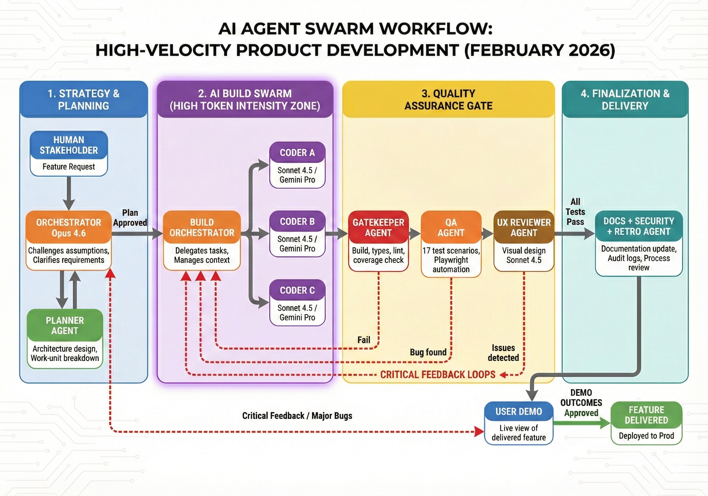

# WinPreview

A Windows-friendly, local-first document viewer and editor for multi-page PDFs and images. Quickly assemble documents at page level — reorder, delete, replace pages, add annotations and text overlays, and export flattened PDFs. All processing runs client-side with zero external services.



## Features

- **Document handling** — Open PDFs (including password-protected) and images; drag & drop from OS
- **Page operations** — Reorder, rotate, flip, crop, insert, delete, replace pages
- **Annotations** — Rectangle, oval, line, arrow, freehand, text, signature, highlight, underline, strikethrough, redaction, sticky notes, star, polygon, speech balloon
- **Selection & editing** — 8-handle resize, drag-to-move, clipboard (copy/cut/paste), undo/redo stack, Select All
- **Text & search** — Native PDF text selection and copy, full-text search with match highlighting (Ctrl+F), case-sensitive toggle, prev/next navigation
- **OCR** — On-device OCR via PaddleOCR (ONNX Runtime), auto language detection (English/Latin/Cyrillic), Force OCR option, spatial text assembly
- **Views** — Zoom (fit width/fit page/actual size), contact sheet, loupe magnifier, mask tool, fullscreen
- **PDF forms** — Interactive form field filling with checkbox, radio, text, dropdown support
- **Clickable links** — PDF hyperlinks rendered as clickable overlays
- **Color adjustment** — Brightness, contrast, saturation, hue rotation per page
- **Export** — Flattened PDF with annotations baked in, multi-format (PDF/PNG/JPEG), batch export
- **Persistence** — Auto-save to IndexedDB, recover on reload
- **Sketch recognition** — Freehand auto-snaps to circles, rectangles, lines, triangles

## Tech Stack

- **React 19** + **TypeScript 5.9** + **Vite 7**
- **Tailwind CSS 4** + **Radix UI** + **Lucide icons**
- **pdf.js** — PDF parsing and rendering
- **pdf-lib** — PDF export with annotation flattening
- **ONNX Runtime Web** — On-device OCR inference (PaddleOCR models)
- **@tanstack/react-virtual** — Virtualized thumbnail sidebar
- **IndexedDB (idb)** — Client-side persistence
- **Vitest** + **Playwright** — Unit and E2E testing

## Getting Started

```bash
npm install
npm run dev
```

Open http://localhost:5173 in your browser.

## Build

```bash
npm run build
npm run preview   # serve production build locally
```

## Testing

```bash
npm test              # unit tests
npm run test:coverage # with coverage
```

## Architecture

Frontend-only SPA — no backend. All document processing (PDF parsing, OCR, export) runs in the browser via Web Workers and WASM. Annotations are stored as vector models (source of truth), rendered to SVG, and flattened into PDF on export.

## License

Private — all rights reserved.
